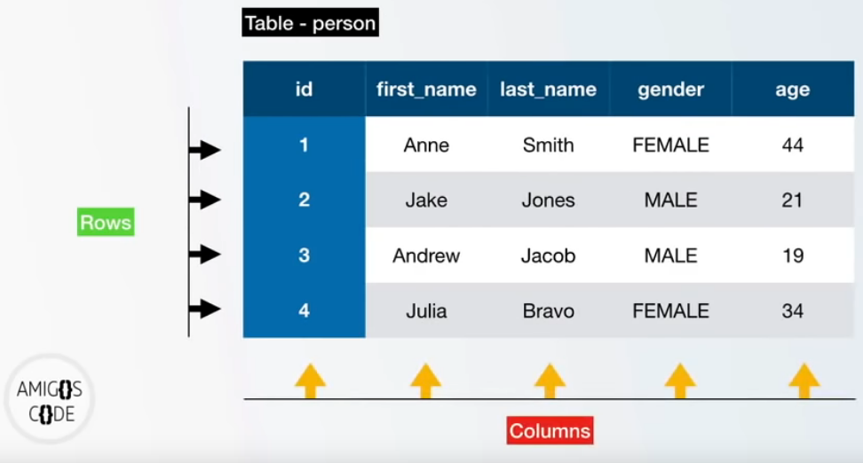
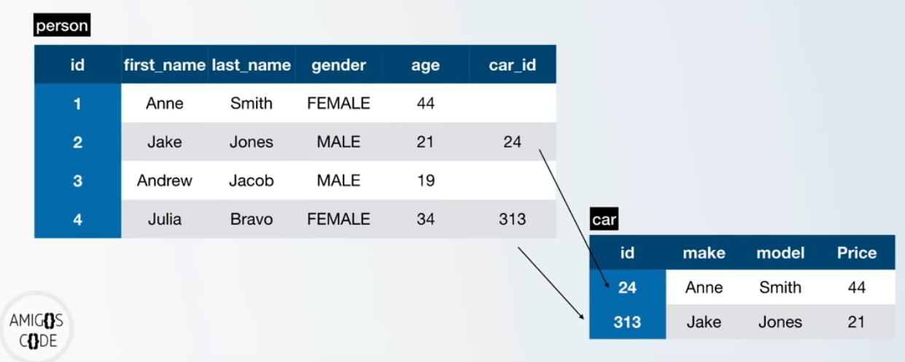
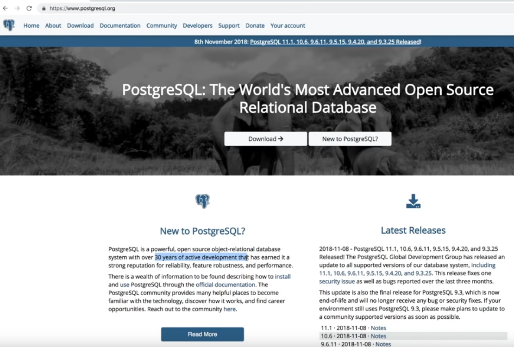
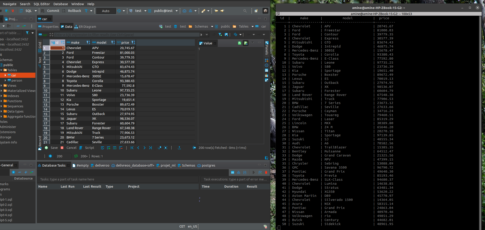

# Tutorial of PostgreSQL

This repo describe a step by step to start using databse with PostgreSQL, it is based on the AmigosCode
[PostgreSQL Crash Course](https://www.youtube.com/watch?v=qw--VYLpxG4&t=292s).

Briefly, Postgres is a database engine and SQL (Structured Query Language) is a programming language to interact with the database

- it manages data held in a relational database
- easy to learn
- very powerful
- exist since 1974

Example:

    SELECT * FROM database_name;

**NOTE:**

- Each SQL commands must ends with a semicolon `;` (or it won't be executed)
- SQL commands are written in UPPERCASE to distinguish them

## Data Structure

Data is held by columns and rows, in a form of table


## Relational Database



# PostgreSQL

- Open source relational database
- Object-oriented database management system
- model



Other options


# Access Database

You can communicate with postgreSQL database either using a terminal or an IDE, e.g. [DBeaver](https://dbeaver.io/)


For the rest of this article, we will be focusing on using SQL commands from the terminal. Once you master that, it will be easy to use an IDE.

# Connect to postgreSQL database

First, start the postgreSQL engine

    user:~$ service postgresql start

Switch the user

    sudo su postgres

if you don't switch the user, you can run into an error

    amine@user:~$ psql
    psql: error: FATAL:  role "amine" does not exist

Check the user with this command

    postgres@user:/home/amine$ whoami
    postgres

Enter `psql (/usr/bin/psql)` command

    postgres@user:/home/amine$ psql
    psql (13.2 (Ubuntu 13.2-1.pgdg20.10+1))
    Type "help" for help.

    postgres=#

you are ready to start now.

One more thing before we start coding, set a password for the user `postgres`

    postgres=# ALTER USER postgres PASSWORD 'yourpassword';
    ALTER ROLE
    postgres@amine-HP-ZBook-15-G2:/home/amine$ psql --help

Enter `psql --help` for more options

    psql is the PostgreSQL interactive terminal.

    Usage:
    psql [OPTION]... [DBNAME [USERNAME]]

    General options:
    -c, --command=COMMAND    run only single command (SQL or internal) and exit
    -d, --dbname=DBNAME      database name to connect to (default: "postgres")
    -f, --file=FILENAME      execute commands from file, then exit
    -l, --list               list available databases, then exit
    -v, --set=, --variable=NAME=VALUE
                            set psql variable NAME to VALUE
                            (e.g., -v ON_ERROR_STOP=1)
    -V, --version            output version information, then exit
    -X, --no-psqlrc          do not read startup file (~/.psqlrc)
    -1 ("one"), --single-transaction
                            execute as a single transaction (if non-interactive)
    -?, --help[=options]     show this help, then exit
        --help=commands      list backslash commands, then exit
        --help=variables     list special variables, then exit

    Input and output options:
    -a, --echo-all           echo all input from script
    -b, --echo-errors        echo failed commands
    -e, --echo-queries       echo commands sent to server
    -E, --echo-hidden        display queries that internal commands generate
    -L, --log-file=FILENAME  send session log to file
    -n, --no-readline        disable enhanced command line editing (readline)
    -o, --output=FILENAME    send query results to file (or |pipe)
    -q, --quiet              run quietly (no messages, only query output)
    -s, --single-step        single-step mode (confirm each query)
    -S, --single-line        single-line mode (end of line terminates SQL command)

    Output format options:
    -A, --no-align           unaligned table output mode
        --csv                CSV (Comma-Separated Values) table output mode
    -F, --field-separator=STRING
                            field separator for unaligned output (default: "|")
    -H, --html               HTML table output mode
    -P, --pset=VAR[=ARG]     set printing option VAR to ARG (see \pset command)
    -R, --record-separator=STRING
                            record separator for unaligned output (default: newline)
    -t, --tuples-only        print rows only
    -T, --table-attr=TEXT    set HTML table tag attributes (e.g., width, border)
    -x, --expanded           turn on expanded table output
    -z, --field-separator-zero
                            set field separator for unaligned output to zero byte
    -0, --record-separator-zero
                            set record separator for unaligned output to zero byte

    Connection options:
    -h, --host=HOSTNAME      database server host or socket directory (default: "/var/run/postgresql")
    -p, --port=PORT          database server port (default: "5432")
    -U, --username=USERNAME  database user name (default: "postgres")
    -w, --no-password        never prompt for password
    -W, --password           force password prompt (should happen automatically)

# Postgre commands

display some help

    postgres=# help
    You are using psql, the command-line interface to PostgreSQL.
    Type:  \copyright for distribution terms
        \h for help with SQL commands
        \? for help with psql commands
        \g or terminate with semicolon to execute query
        \q to quit
    postgres=#

get more help with `\?` command

    General
    \copyright             show PostgreSQL usage and distribution terms
    \crosstabview [COLUMNS] execute query and display results in crosstab
    \errverbose            show most recent error message at maximum verbosity
    \g [(OPTIONS)] [FILE]  execute query (and send results to file or |pipe);
                            \g with no arguments is equivalent to a semicolon
    \gdesc                 describe result of query, without executing it
    \gexec                 execute query, then execute each value in its result
    \gset [PREFIX]         execute query and store results in psql variables
    \gx [(OPTIONS)] [FILE] as \g, but forces expanded output mode
    \q                     quit psql
    \watch [SEC]           execute query every SEC seconds

    Help
    \? [commands]          show help on backslash commands
    \? options             show help on psql command-line options
    \? variables           show help on special variables
    \h [NAME]              help on syntax of SQL commands, * for all commands

    Query Buffer
    \e [FILE] [LINE]       edit the query buffer (or file) with external editor
    \ef [FUNCNAME [LINE]]  edit function definition with external editor
    \ev [VIEWNAME [LINE]]  edit view definition with external editor
    \p                     show the contents of the query buffer
    \r                     reset (clear) the query buffer
    \s [FILE]              display history or save it to file
    \w FILE                write query buffer to file

    Input/Output
    \copy ...              perform SQL COPY with data stream to the client host
    \echo [-n] [STRING]    write string to standard output (-n for no newline)
    \i FILE                execute commands from file
    \ir FILE               as \i, but r elative to location of current script
    \o [FILE]              send all query results to file or |pipe
    \qecho [-n] [STRING]   write string to \o output stream (-n for no newline)
    \warn [-n] [STRING]    write string to standard error (-n for no newline)

    Conditional
    \if EXPR               begin conditional block
    \elif EXPR             alternative within current conditional block
    \else                  final alternative within current conditional block
    \endif                 end conditional block

display help with SQL command

    postgres=# \h

display help with postgreSQL command

    postgres=# \?

quit the database

    postgres=# \q

display list of roles

    postgres=# \du

display list of databases

    postgres@user:/home/amine$ psql -l

    or

    postgres=# \l
                                        List of databases
    Name    |  Owner   | Encoding |   Collate   |    Ctype    |   Access privileges
    -----------+----------+----------+-------------+-------------+-----------------------
    postgres  | postgres | UTF8     | en_US.UTF-8 | en_US.UTF-8 |
    template0 | postgres | UTF8     | en_US.UTF-8 | en_US.UTF-8 | =c/postgres          +
            |          |          |             |             | postgres=CTc/postgres
    template1 | postgres | UTF8     | en_US.UTF-8 | en_US.UTF-8 | =c/postgres          +
            |          |          |             |             | postgres=CTc/postgres
    (4 rows)

display list of relation databases

    postgres=# \d
            List of relations
    Schema |  Name  | Type  |  Owner
    --------+--------+-------+----------
    public | person | table | postgres
    (1 row)

create a database

    postgres=# CREATE DATABASE test;
    CREATE DATABASE

connect to database

    postgres=# \c test

or from the terminal

    postgres@user:/home/amine$ psql -h localhost -p 5432 -U postgres test

    postgres@user:/home/amine$ psql -d test

create a table

    CREATE TABLE person (
    id BIGSERIAL NOT NULL PRIMARY KEY,
    first_name VARCHAR(50) NOT NULL,
    last_name VARCHAR(50) NOT NULL,
    gender VARCHAR(7) NOT NULL,
    date_of_birth DATE NOT NULL,
    email VARCHAR(10) );

drop database

    test=# DROP TABLE person;
    DROP TABLE

    test=# \d person
    id | integer | | |
    first_name | character varying(50) | | |
    last_name | character varying(50) | | |
    date_of_birth | timestamp without time zone | | |
    gender | character varying(7) | | |

insert record into table

    postgres=# INSERT INTO person (
    postgres(# first_name,
    postgres(# last_name,
    postgres(# gender,
    postgres(# date_of_birth)
    postgres-#
    postgres-# VALUES ('Anne', 'Smith', 'FEMALE', DATE '1988-01-09');
    INSERT 0 1
    postgres=# \dt
            List of relations
    Schema |  Name  | Type  |  Owner
    --------+--------+-------+----------
    public | person | table | postgres
    (1 row)

# Generate 1000 rows with [Mockaroo](https://mockaroo.com/)

- Generate a table in Mockaroo
- Export the database using SQL (add create table commands):
  person.sql
- Open the file with VSCode and edit the create table command: e.g. add not null

  ```
  create table person (
  id BIGSERIAL NOT NULL PRIMARY KEY,
  first_name VARCHAR(50) NOT NULL,
  last_name VARCHAR(50) NOT NULL,
  email VARCHAR(150),
  gender VARCHAR(17) NOT NULL,
  date_of_birth DATE NOT NULL,
  country_of_birth VARCHAR(50)
  );

  insert into person (id, first_name, last_name, email, gender, date_of_birth, country_of_birth) values (1, 'Kalie', 'Linley', null, 'Genderqueer', '2020-10-14', 'China');
  insert into person (id, first_name, last_name, email, gender, date_of_birth, country_of_birth) values (2, 'Ethelyn', 'MacLaughlin', null, 'Polygender', '2020-08-15', 'Syria');
  ```

- load the database in psql shell:
  `\i person.sql`
  `\i car.sql`

        test-# \d person
        Table "public.person"
        Column | Type | Collation | Nullable | Default
        ------------------+------------------------+-----------+----------+------------------------------------
        id | bigint | | not null | nextval('person_id_seq'::regclass)
        first_name | character varying(50) | | not null |
        last_name | character varying(50) | | not null |
        email | character varying(150) | | |
        gender | character varying(17) | | not null |
        date_of_birth | date | | not null |
        country_of_birth | character varying(50) | | |
        Indexes:
        "person_pkey" PRIMARY KEY, btree (id)

        test-# \d car
        Table "public.car"
        Column | Type | Collation | Nullable | Default
        --------+-----------------------+-----------+----------+---------------------------------
        id | bigint | | not null | nextval('car_id_seq'::regclass)
        make | character varying(50) | | |
        model | character varying(50) | | |
        price | numeric(19,2) | | |
        Indexes:
        "car_pkey" PRIMARY KEY, btree (id)

- Display the database:
  `SELECT \* FROM person;`

# SELECT FROM

    test=# SELECT * FROM person;
    test=# SELECT first_name FROM person;

# ORDER BY

    test=# SELECT * FROM person
    test-# ORDER BY email;
    test=# SELECT *  FROM person ORDER BY country_of_birth DESC;
    test=# SELECT *  FROM person ORDER BY id DESC;

    test=# SELECT \* FROM person ORDER BY gender, email ASC;

# Distinct

This command remove duplicates

    test=# SELECT DISTINCT country_of_birth FROM person ORDER BY country_of_birth;

         country_of_birth
    ----------------------------------
     Afghanistan
     Albania
     Argentina
     Armenia
     Australia
     Azerbaijan
     Bahamas
     Bangladesh
     Belarus
     Benin
     Bhutan
     Bolivia
     Bosnia and Herzeg

Another example

    test=# SELECT DISTINCT gender FROM person ORDER BY gender;
       gender
    -------------
     Agender
     Bigender
     Female
     Genderfluid
     Genderqueer
     Male
     Non-binary
     Polygender
    (8 rows)

# WHERE clause and AND

The where clause alow to filter the data based on condition

    test=# SELECT \* FROM person WHERE gender='Male';

    id | first_name | last_name | email | gender | date_of_birth | country_of_birth
    -----+--------------+--------------+--------------------------------------+--------+---------------+------------------
    17 | Burk | Stuehmeier | bstuehmeierg@exblog.jp | Male | 2020-11-18 | Sweden
    18 | Keenan | Northill | knorthillh@vkontakte.ru | Male | 2021-04-01 | France
    29 | Eric | Lampke | elampkes@last.fm | Male | 2020-04-07 | Canada
    39 | Dukie | Bonnefin | dbonnefin12@angelfire.com | Male | 2020-04-15 | Mongolia
    53 | Doy | Lowes | | Male | 2020-10-16 | Honduras

Another example

    test=# SELECT * FROM person WHERE gender='Male' AND country_of_birth='France';
     id  | first_name | last_name |          email           | gender | date_of_birth | country_of_birth
    -----+------------+-----------+--------------------------+--------+---------------+------------------
      18 | Keenan     | Northill  | knorthillh@vkontakte.ru  | Male   | 2021-04-01    | France
     135 | Ingar      | Olanda    | iolanda3q@oracle.com     | Male   | 2021-02-03    | France
     571 | Mallissa   | Twiddell  | mtwiddellfu@freewebs.com | Male   | 2020-11-24    | France
     663 | Sergent    | Malarkey  | smalarkeyie@addtoany.com | Male   | 2020-10-07    | France
    (4 rows)

    test=# SELECT * FROM person WHERE gender='Male' AND country_of_birth='France' OR country_of_birth='China';

    	  id  | first_name |   last_name    |               email                |   gender    | date_of_birth | country_of_birth
    -----+------------+----------------+------------------------------------+-------------+---------------+------------------
       1 | Kalie      | Linley         |                                    | Genderqueer | 2020-10-14    | China
      12 | Lillian    | Southorn       | lsouthornb@nytimes.com             | Agender     | 2021-01-12    | China
      16 | Rosa       | Harkess        | rharkessf@elpais.com               | Genderqueer | 2020-07-13    | China
      18 | Keenan     | Northill       | knorthillh@vkontakte.ru            | Male        | 2021-04-01    | France
      21 | Verena     | Kasman         | vkasmank@artisteer.com             | Non-binary  | 2020-08-28    | China
      27 | Rubia      | Wellsman       | rwellsmanq@tripod.com              | Agender     | 2020-05-05    | China
      30 | Maurene    | Kinkaid        | mkinkaidt@nymag.com                | Non-binary  | 2020-06-01    | China

    test=# SELECT * FROM person WHERE gender='Male' AND (country_of_birth='France' OR country_of_birth='China') AND first_name='Mame';

     id  | first_name | last_name | email | gender | date_of_birth | country_of_birth
    -----+------------+-----------+-------+--------+---------------+------------------
     323 | Mame       | Perigo    |       | Male   | 2020-06-29    | China
    (1 row)

# Comparison Operators

Comparison between arithmetic

    test=# SELECT 1 = 1 ;
     ?column?
    ----------
     t   # True
    (1 row)

    test=# SELECT 1 < 0;
     ?column?
    ----------
     f   # False
    (1 row)

    test=# SELECT 'Amine' <> 'Enima';  # different
     ?column?
    ----------
     t
    (1 row)

# Limit, Offset & Fetch

LIMIT

    test=# SELECT * FROM person LIMIT 5;

     id | first_name |  last_name  |          email           |   gender    | date_of_birth | country_of_birth
    ----+------------+-------------+--------------------------+-------------+---------------+------------------
      1 | Kalie      | Linley      |                          | Genderqueer | 2020-10-14    | China
      2 | Ethelyn    | MacLaughlin |                          | Polygender  | 2020-08-15    | Syria
      3 | Bancroft   | Varren      | bvarren2@live.com        | Female      | 2020-08-25    | Nigeria
      4 | Jessamyn   | Eggle       | jeggle3@sohu.com         | Agender     | 2020-05-21    | Croatia
      5 | Andrei     | Dilleston   | adilleston4@symantec.com | Genderqueer | 2020-10-28    | Philippines
    (5 rows)

OFFSET

    test=# SELECT \* FROM person OFFSET 9 LIMIT 2;
    id | first_name | last_name | email | gender | date_of_birth | country_of_birth
    ----+------------+-----------+-------------------+-------------+---------------+------------------
    10 | Ronnie | Gabb | rgabb9@ebay.co.uk | Non-binary | 2020-06-21 | Indonesia
    11 | Aidan | Lebang | | Genderfluid | 2020-06-17 | Thailand
    (2 rows)

Fetch (like LIMIT)

    test=# SELECT * FROM person OFFSET 5 FETCH FIRST 2 ROW ONLY;

     id | first_name |  last_name  |        email         |   gender    | date_of_birth | country_of_birth
    ----+------------+-------------+----------------------+-------------+---------------+------------------
      6 | Maggi      | Dobrowolski |                      | Non-binary  | 2021-01-25    | Indonesia
      7 | Noni       | Scaife      | nscaife6@auda.org.au | Genderfluid | 2020-09-19    | Russia
    (2 rows)

# IN

    test=# SELECT * FROM person WHERE country_of_birth IN ('France', 'China', 'Brazil');

     id  | first_name |   last_name    |               email                |   gender    | date_of_birth | country_of_birth
    -----+------------+----------------+------------------------------------+-------------+---------------+------------------
       1 | Kalie      | Linley         |                                    | Genderqueer | 2020-10-14    | China
      12 | Lillian    | Southorn       | lsouthornb@nytimes.com             | Agender     | 2021-01-12    | China
      16 | Rosa       | Harkess        | rharkessf@elpais.com               | Genderqueer | 2020-07-13    | China
      18 | Keenan     | Northill       | knorthillh@vkontakte.ru            | Male        | 2021-04-01    | France
      21 | Verena     | Kasman         | vkasmank@artisteer.com             | Non-binary  | 2020-08-28    | China
      27 | Rubia      | Wellsman       | rwellsmanq@tripod.com              | Agender     | 2020-05-05    | China

    test=# SELECT * FROM person WHERE country_of_birth IN ('France', 'China', 'Brazil')
    ORDER BY country_of_birth;

# Between

Select data from range

    test=# SELECT * FROM person WHERE date_of_birth BETWEEN '2021-02-01' AND '2021-02-03';

     id  | first_name |   last_name    |         email          |   gender    | date_of_birth | country_of_birth
    -----+------------+----------------+------------------------+-------------+---------------+------------------
     135 | Ingar      | Olanda         | iolanda3q@oracle.com   | Male        | 2021-02-03    | France
     294 | Janeta     | Mynard         | jmynard85@ehow.com     | Female      | 2021-02-03    | United States
     325 | Willard    | Sappell        | wsappell90@usnews.com  | Bigender    | 2021-02-03    | Indonesia
     457 | Lavena     | Dungay         |                        | Genderfluid | 2021-02-02    | Indonesia
     666 | Karlene    | Hamberstone    | khamberstoneih@msn.com | Male        | 2021-02-02    | United States
     703 | Clyve      | Bevans         |                        | Male        | 2021-02-03    | Malta
     714 | Kris       | Dowzell        | kdowzelljt@dedecms.com | Female      | 2021-02-03    | China
     760 | Grata      | De'Vere - Hunt |                        | Female      | 2021-02-03    | China
     782 | Jeniffer   | Slowan         |                        | Genderqueer | 2021-02-01    | China
    (9 rows)

# Like and iLike

It is used to match a text value against a pattern, using wildcards

Find rows where emal ends with '.com'

    test=# SELECT * FROM person WHERE email LIKE '%.com';

or only 'bloomberg.com'

    test=# SELECT * FROM person WHERE email LIKE '%@bloomberg.com';

     id  | first_name | last_name |           email           |   gender   | date_of_birth | country_of_birth
    -----+------------+-----------+---------------------------+------------+---------------+------------------
     341 | Rene       | Aldhouse  | raldhouse9g@bloomberg.com | Bigender   | 2020-05-01    | Russia
     917 | Napoleon   | Scruton   | nscrutonpg@bloomberg.com  | Non-binary | 2020-11-08    | China
    (2 rows)

Another example

    test=# SELECT * FROM person WHERE email LIKE '%@google.%' LIMIT 3;

     id  | first_name | last_name |           email           |   gender    | date_of_birth | country_of_birth
    -----+------------+-----------+---------------------------+-------------+---------------+------------------
      35 | Conrade    | Meriguet  | cmeriguety@google.pl      | Genderqueer | 2020-10-09    | Japan
     150 | Janella    | Saiz      | jsaiz45@google.it         | Female      | 2020-11-15    | Russia
     160 | Leone      | Cattroll  | lcattroll4f@google.com.br | Genderfluid | 2020-04-24    | Philippines

Pattern with number of character

    test=# SELECT * FROM person WHERE email LIKE '________@%' LIMIT 3;

     id | first_name | last_name |         email          |   gender    | date_of_birth | country_of_birth
    ----+------------+-----------+------------------------+-------------+---------------+------------------
      3 | Bancroft   | Varren    | bvarren2@live.com      | Female      | 2020-08-25    | Nigeria
      7 | Noni       | Scaife    | nscaife6@auda.org.au   | Genderfluid | 2020-09-19    | Russia
     21 | Verena     | Kasman    | vkasmank@artisteer.com | Non-binary  | 2020-08-28    | China
    (3 rows)

Another example

    test=# SELECT * FROM person WHERE email LIKE '___h%' LIMIT 3;

     id  |  first_name  | last_name |         email         |   gender   | date_of_birth | country_of_birth
    -----+--------------+-----------+-----------------------+------------+---------------+------------------
      15 | Dorothea     | Johnigan  | djohnigane@com.com    | Agender    | 2020-10-02    | Poland
     268 | Damaris      | De Hoogh  | ddehoogh7f@etsy.com   | Non-binary | 2021-01-30    | China

iLike: ignore the capital in the character

    test=# SELECT * FROM person WHERE country_of_birth LIKE 'P%' LIMIT 3;
     id | first_name | last_name |          email           |   gender    | date_of_birth | country_of_birth
    ----+------------+-----------+--------------------------+-------------+---------------+------------------
      5 | Andrei     | Dilleston | adilleston4@symantec.com | Genderqueer | 2020-10-28    | Philippines
     14 | Cindie     | Themann   | cthemannd@youtube.com    | Genderqueer | 2020-08-25    | Peru
     15 | Dorothea   | Johnigan  | djohnigane@com.com       | Agender     | 2020-10-02    | Poland
    (3 rows)

    test=# SELECT * FROM person WHERE country_of_birth iLIKE 'p%' LIMIT 3;
     id | first_name | last_name |          email           |   gender    | date_of_birth | country_of_birth
    ----+------------+-----------+--------------------------+-------------+---------------+------------------
      5 | Andrei     | Dilleston | adilleston4@symantec.com | Genderqueer | 2020-10-28    | Philippines
     14 | Cindie     | Themann   | cthemannd@youtube.com    | Genderqueer | 2020-08-25    | Peru
     15 | Dorothea   | Johnigan  | djohnigane@com.com       | Agender     | 2020-10-02    | Poland

# Group By

    test=# SELECT country_of_birth, COUNT(*) AS total_appearance FROM person GROUP BY country_of_birth ORDER BY total_appearance DESC;
    	 country_of_birth         | total_appearance
    ----------------------------------+------------------
     China                            |              195
     Indonesia                        |              103
     Philippines                      |               61
     Russia                           |               55
     Brazil                           |               34
     Portugal                         |               29
     Sweden                           |               29
     United States                    |               29
     Poland                           |               28
     France                           |               26
     Ukraine                          |               21
     Peru                             |               17
     Japan                            |               17

# Group By Having

Perform extract filtering after you perfom aggragation. It must comes after Goup by and before Order By

    test=# SELECT country_of_birth, COUNT(*) AS total_appearance FROM person GROUP BY country_of_birth HAVING COUNT(*)>=20 ORDER BY total_appearance DESC;

    country_of_birth | total_appearance
    ------------------+------------------
    China | 195
    Indonesia | 103
    Philippines | 61
    Russia | 55
    Brazil | 34
    Portugal | 29
    United States | 29
    Sweden | 29
    Poland | 28
    France | 26
    Ukraine | 21
    (11 rows)

# Aggregations functions: MAX, MIN, COUNT, AVG, SUM, ROUND...

Straight forward use of [aggregations functions](https://www.postgresql.org/docs/9.1/functions-aggregate.html)

    test=# SELECT MAX(price), MIN(price), ROUND(AVG(price)), COUNT(price), SUM(price) FROM car;
    max    |   min    | round | count |     sum
    ----------+----------+-------+-------+-------------
    99989.53 | 10033.22 | 54729 |  1000 | 54728508.18
    (1 row)

Another example combining GROUP BY and LIMIT

    test=# SELECT make, ROUND(AVG(price)) AS avaage FROM car GROUP BY make LIMIT 3;
    make   | avarage
    ----------+-------
    Ford     | 57735
    Smart    | 63322
    Maserati | 49020
    (3 rows)

# Basics of Arithmetic Operators

Select column and perform arithmitic

    test=# SELECT 10/2 AS div, 5+2 AS add, 13-7AS sub, 3*3AS mult, 5! AS factorial, 9%3 AS modular
    ;
    div | add | sub | mult | factorial | modular
    -----+-----+-----+------+-----------+---------
    5 |   7 |   6 |    9 |       120 |       0
    (1 row)

# Arithmitic Operator - Round

Grab a column and compute the 10% of the price, then substract it from the price

    test=# SELECT id, make, model, price, ROUND(price * .10,2) AS price_10_pct, ROUND(price - price *0.1,2) AS price_discount  FROM car LIMIT 3;
    id |   make    |  model   |  price   | price_10_pct | price_discount
    ----+-----------+----------+----------+--------------+----------------
    1 | Chevrolet | APV      | 20745.67 |      2074.57 |       18671.10
    2 | Ford      | Freestar | 81000.03 |      8100.00 |       72900.03
    3 | Ford      | Contour  | 39779.35 |      3977.94 |       35801.42
    (3 rows)

# Alias

COALESCE fill missing values with a dafault one

    test=# SELECT COALESCE(email, 'NaN') FROM person LIMIT 10;
            coalesce
    ---------------------------
    NaN
    NaN
    bvarren2@live.com
    jeggle3@sohu.com
    adilleston4@symantec.com
    NaN
    nscaife6@auda.org.au
    NaN
    mrippingale8@stanford.edu
    rgabb9@ebay.co.uk
    (10 rows)

# NULLIF

It can be used to tackle exception, e.g. a devision by zero. NULLIF return NULL if the statement are equal.
test=# SELECT NULLIF(100, 15) ;
nullif

---

100
(1 row)

    test=# SELECT NULLIF(100, 100)  ;
    nullif
    --------

    (1 row)

Handling a devision by zero

    test=# SELECT COALESCE(10/NULLIF(0, 0), 0);
    coalesce
    ----------
    0
    (1 row)

    test=# SELECT COALESCE(9/NULLIF(3, 0), 0);
    coalesce
    ----------
            3
    (1 row)

# Timestamps and Dates

It is important to manage dates in SQL: [Docs datatype-datetime](https://www.postgresql.org/docs/9.1/datatype-datetime.html)

    test=# SELECT NOW(),  NOW()::DATE AS date, NOW()::TIME AS time;
                now              |    date    |      time
    -------------------------------+------------+-----------------
    2021-04-03 13:34:09.977491+02 | 2021-04-03 | 13:34:09.977491
    (1 row)

# Adding and substracting with Dates

    test=# SELECT (NOW()- INTERVAL '1 YEAR 2 MONTH')::DATE,  NOW()::DATE AS date, NOW()::TIME AS time;
        date    |    date    |      time
    ------------+------------+-----------------
    2020-02-03 | 2021-04-03 | 13:40:00.030976
    (1 row)

# Extracting Fields

test=# SELECT EXTRACT(YEAR FROM NOW()), EXTRACT(DAY FROM NOW()), EXTRACT(CENTURY FROM NOW());
date_part | date_part | date_part
-----------+-----------+-----------
2021 | 3 | 21
(1 row)

# Age function

    test=# SELECT first_name, last_name, gender, date_of_birth,  AGE(NOW(), date_of_birth) AS age FROM person ORDER BY age DESC LIMIT 5;
    first_name | last_name  |   gender    | date_of_birth |             age
    ------------+------------+-------------+---------------+------------------------------
    Eolande    | Frill      | Polygender  | 2020-04-02    | 1 year 1 day 14:01:32.663678
    Hanni      | Zanardii   | Polygender  | 2020-04-02    | 1 year 1 day 14:01:32.663678
    Cinnamon   | Brideau    | Genderfluid | 2020-04-02    | 1 year 1 day 14:01:32.663678
    Leoine     | Robertsson | Male        | 2020-04-02    | 1 year 1 day 14:01:32.663678
    Bren       | Bleibaum   | Male        | 2020-04-02    | 1 year 1 day 14:01:32.663678
    (5 rows)

# Primary Keys

Primary key (PK) uniquely identify a record in a tables to prevent duplicate information

Remove Primery Key constraint

    test=# ALTER TABLE person DROP CONSTRAINT person_pkey;

Since no constraint exist, we can add a row with the same `id`

    test=# insert into person (id, first_name, last_name, email, gender, date_of_birth, country_of_birth) values (1, 'Kalie', 'Linley', null, 'Genderqueer', '2020-10-14', 'China');

    test=# SELECT * FROM person WHERE id =1;
    id | first_name | last_name | email |   gender    | date_of_birth | country_of_birth
    ----+------------+-----------+-------+-------------+---------------+------------------
    1 | Kalie      | Linley    |       | Genderqueer | 2020-10-14    | China
    1 | Kalie      | Linley    |       | Genderqueer | 2020-10-14    | China
    (2 rows)

Add Primary key constraint

**NOTE:** we must ensure that there is only a unique id.

- Remove two columns with the same id (=1)

        test=# DELETE FROM person WHERE id=1;
        DELETE 2

- Insert back the row with id (=1)

        test=# insert into person (id, first_name, last_name, email, gender, date_of_birth, country_of_birth) values (1, 'Kalie', 'Linley', null, 'Genderqueer', '2020-10-14', 'China');
        INSERT 0 1

        test=# SELECT \* FROM person WHERE id =1;
        id | first_name | last_name | email | gender | date_of_birth | country_of_birth
        ----+------------+-----------+-------+-------------+---------------+------------------
        1 | Kalie | Linley | | Genderqueer | 2020-10-14 | China
        (1 row)

- Add primary key constraint

        test=# ALTER TABLE person ADD PRIMARY KEY (id);
        ALTER TABLE

        test=# \d person
                                                Table "public.person"
            Column      |          Type          | Collation | Nullable |              Default
        ------------------+------------------------+-----------+----------+------------------------------------
        id               | bigint                 |           | not null | nextval('person_id_seq'::regclass)
        first_name       | character varying(50)  |           | not null |
        last_name        | character varying(50)  |           | not null |
        email            | character varying(150) |           |          |
        gender           | character varying(17)  |           | not null |
        date_of_birth    | date                   |           | not null |
        country_of_birth | character varying(50)  |           |          |
        Indexes:
            "person_pkey" PRIMARY KEY, btree (id)

# Unique Constraint

It allow us tow have unique value per column

    test=# ALTER TABLE person ADD CONSTRAINT unique_email_address UNIQUE (email);
    ALTER TABLE
    test=# \d person
                                            Table "public.person"
        Column      |          Type          | Collation | Nullable |              Default
    ------------------+------------------------+-----------+----------+------------------------------------
    id               | bigint                 |           | not null | nextval('person_id_seq'::regclass)
    first_name       | character varying(50)  |           | not null |
    last_name        | character varying(50)  |           | not null |
    email            | character varying(150) |           |          |
    gender           | character varying(17)  |           | not null |
    date_of_birth    | date                   |           | not null |
    country_of_birth | character varying(50)  |           |          |
    Indexes:
        "person_pkey" PRIMARY KEY, btree (id)
        "unique_email_address" UNIQUE CONSTRAINT, btree (email)

Another way to add UNIQUE constaint

    test=# ALTER TABLE person ADD UNIQUE (email);
    ALTER TABLE
    test=# \d person
                                            Table "public.person"
        Column      |          Type          | Collation | Nullable |              Default
    ------------------+------------------------+-----------+----------+------------------------------------
    id               | bigint                 |           | not null | nextval('person_id_seq'::regclass)
    first_name       | character varying(50)  |           | not null |
    last_name        | character varying(50)  |           | not null |
    email            | character varying(150) |           |          |
    gender           | character varying(17)  |           | not null |
    date_of_birth    | date                   |           | not null |
    country_of_birth | character varying(50)  |           |          |
    Indexes:
        "person_pkey" PRIMARY KEY, btree (id)
        "person_email_key" UNIQUE CONSTRAINT, btree (email)

Delete the added constaint

    test=# ALTER TABLE person DROP CONSTRAINT unique_email_address;
    ALTER TABLE
    test=# \d person
                                            Table "public.person"
        Column      |          Type          | Collation | Nullable |              Default
    ------------------+------------------------+-----------+----------+------------------------------------
    id               | bigint                 |           | not null | nextval('person_id_seq'::regclass)
    first_name       | character varying(50)  |           | not null |
    last_name        | character varying(50)  |           | not null |
    email            | character varying(150) |           |          |
    gender           | character varying(17)  |           | not null |
    date_of_birth    | date                   |           | not null |
    country_of_birth | character varying(50)  |           |          |
    Indexes:
        "person_pkey" PRIMARY KEY, btree (id)

# Check Constraints

It alow to add a constainst based on a boolean condition

# DELETE and UPDATE

Delete a record from a table

    test=# DELETE FROM person where gender= 'Female' AND country_of_birth = 'England';

Update a record

    test=# UPDATE person SET email = 'ommar@gmail.com' WHERE id = 2011;

    test=# UPDATE person SET first_name='Omar', last_name='Montana', email='Djibril@gmail.com' WHERE id=1;

# On conflict Do Nothing

Handling confliting scenarios

    ON CONFLICT (id) DO NOTHING;

# Upsert

# INNER JOINS

It takes two tables, and return a new records with common data

# Adding new table and using Mackaroo

# install dbeaver using snap

    sudo snap install dbeaver-ce

# References

- [PostgreSQL Documentation](https://www.postgresql.org/docs/current/)
- [Aggregates functions: Max, Min, Count, Sum ...](https://www.postgresql.org/docs/9.1/functions-aggregate.html)
- [PostgreSQL Crash Course](https://www.youtube.com/watch?v=qw--VYLpxG4&t=292s)

- [Mockaroo - Random Data Generator and API Mocking Tool](https://mockaroo.com/)

- [Wikipedia: SQL](https://en.wikipedia.org/wiki/SQL)
- [Install postgreSQL linux](https://www.postgresql.org/download/linux/ubuntu/)
